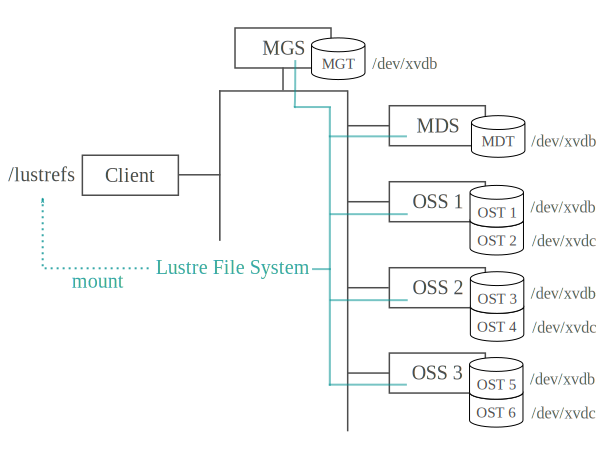

# 架构与性能

### 1.概述 

Lustre是Scale-Out存储架构，借助强大的横向扩展能力，通过增加服务器即可方便扩展系统总存储容量和性能。Lustre的集群和并行架构，非常适合众多客户端并发进行大文件读写的场合，但目前对于小文件应用非常不适用，尤其是海量小文件应用LOSF（Lots Of Small Files）。

### 2.架构

它由三个部件组成：元数据服务器（Metadataservers, MDSs）、对象存储服务器（objectstorage servers, OSSs）和客户端。图1给出了文件系统的体系结构。Lustre使用块设备来作为文件数据和元数据的存储介质，每个块设备只能由一个Lustre服务管理。Lustre文件系统的容量是所有单个OST的容量之和。客户端通过POSIX I/O系统调用来并行访问和使用数据。

* MDS（元数据服务器）提供元数据服务。相应的，MDC（元数据客户端）则是这些服务的客户端。每个文件系统的一个MDS管理一个元数据目标（MDT）。MDT存储诸如文件名、文件夹结构、访问权限之类的文件元数据。

* MGS（管理服务器）提供Lustre文件系统的配置信息。

* OSS（对象存储服务器）expose块设备并提供数据。对应的OSC（对象存储客户端）则是这些服务的客户端。每个OSS管理一个或者多个对象存储目标（OSTs），而OSTs存储文件数据对象。

### 3.Lustre Stripe

作为一个遵从POSIX标准的文件系统，Lustre为用户提供了诸如open()、read()、write()等统一的文件系统接口。在Linux中，这些接口是通过虚拟文件系统（Virtual File System,VFS）层实现的（在BSD/Solaris中，则称为vnode层）。为了提供这些接口，Lustre中有一个称为llite的薄层，与VFS相连。接着，到达llite的文件操作请求，通过整个的Lustre软件栈来访问Lustre文件系统，如Figure 2所示。

在Lustre中，诸如创建、打开、读等一般的文件操作，都需要存储在MDS上的元数据信息。这些服务通过一个称为MDC的客户端接口模块来访问。

从MDS的观点来看，每个文件都是分条（stripe）在一个或者多个OST上的多个数据对象的集合。一个文件的布局（layout）信息在索引节点（inode）的扩展属性（extended attribute, EA）中定义。从本质上说，EA描述了从文件对象ID到它对应的OST之间的映射关系。这些信息成为分条扩展属性（striping EA）。

Lustre采用对象存储技术，将大文件分片并以类似RAID0的方式分散存储在多个OST上，一个文件对应多个OST上的对象。Lustre系统中，每个文件对应MDT上的一个元数据文件，inode以扩展属性记录了数据分片布局信息，包括stripe_count（对象数）, stripe_size（分片大小）, stripe_offset（起始OST）以及每个OST对象信息。当客户数据端访问文件时，首先从MDS请求文件元数据并获得分片布局信息（stripe layout），然后直接与多个OST同时交互进行并发读写。Lustre这种数据分片策略，提高了多用户访问的并发度和聚合I/O带宽，这是Lustre获得高性能的主要因素。

Stripe还能够使得Lustre可以存储超大文件，突破单一OST对文件大小的限制。同时，数据分片策略同时也会带来负面影响，比如增加系统负载和数据风险。

Lustre的OST数量可以达到数千，但是出于复杂性、性能、实际存储需求等考虑，目前设计实现中将单个文件对象数限制为160个。对于EXT4后端文件系统，单个文件最大可达2TB，因此Lustre单个文件最大可以达到320TB。那么，Lustre如何在可用OST集合中选择合适的OST呢？目前有两种选择算法，即Round-Robin和随机加权算法，这两种算法调度的依据是，任意两个OST剩余存储容量相差是否超过20%的阈值。一般在系统使用之初，直接使用Round-Robin算法以顺序轮转方式选择OST，这种算法非常高效。

随着文件数据量的增加，一旦达到20%的阈值，Lustre将启用随机加权算法选择OST。Lustre维护着一个剩余空间的优先列表，采用随机算法在此列表中选择OST，这种算法会产生开销并影响性能。如果任意两个OST剩余存储容量相差重新降到20%阈值之内，则重新启用Round-Robin算法选择OST。

Lustre在创建文件时就按照分片模式并采用OST选择算法，预先创建好文件所需的OST对象。分片模式可以使用lfs setstripe进行设置，或者由系统自动选择缺省模式，文件目录会自动继承父目录的分片模式，但可以进行修改。数据写入后，文件分片模式就不能修改，新加入的OST只会参与新创建的文件目录OST选择调度。Lustre目前还没有实现OST存储空间的自动均衡，需要手工进行数据迁移复制达到均衡的效果。

Lustre缺省情况下，stripe_count = 1, stripe_size = 1MB, stripe_offset = -1，即每个文件仅包含一个OST对象，分片大小为1MB，起始OST由Lustre自动选择。实际上这种分片模式就是不对文件进行分片存储，显然不能满足许多应用的存储需求，实际应用时需要在分析数据特点、网络环境、访问行为的基础上进行适当配置。

分片不是越多越好，在满足存储需求的前提下，应该使得OST对象数量尽可能少。应用lustre Stripe时，应该考虑如下因素： 

* a.提供高带宽访问：Lustre文件分片并存储于多个OSS，对于单一大文件来说，它可以提供远大于单一OSS提供的聚合I/O带宽。在HPC环境中，成百上千的客户端会同时并发读写同一个文件，当文件很大时，分散与多个OSS能够获得非常高的聚合带宽。Lustre文件系统理论上可以提供2.5 TB/s的带宽，经过验证的带宽达到240 GB/s。当然对于小于1GB的文件来说，分片数量不宜多于4个，更多分片不会带来更高的性能提升，还会引入额外开销。对于小文件，文件大小本身可能小于分片大小，实际上是不作分片，对性能不会有提升

* b.改善性能。如果聚合的客户端带宽超过单个OSS的带宽，文件分片存储策略可以充分利用聚合的OSS带宽，极大提高性能，为应用程序提供高速的数据读写访问。合理的分片数量可以估算，客户端聚合I/O带宽除以单个OSS I/O性能即可得到。
* c.提供超大容量文件。Lustre后端文件系统采用改进的EXT3文件系统（接近于EXT4），单个文件最大为2TB。如果不进行分片，则单个Lustre文件最大只能为2TB。Lustre目前分片最多可达到160个，因此文件最大可以达到320TB，这是容量是非常大的，基本上可以满足所有单一文件存储容量的需求。
* d.提高存储空间利用率。当Lustre剩余存储空间有限时，每个OSS的剩余空间也就更加有限，这时再写入一个的大文件至单一OSS很大可能会由于空间不足而失败。采用分片策略，写入单个OSS的对象容量会成倍减小，如果OSS数量选择合适，文件仍然可以写入Lustre系统。这使得Lustre存储空间利用更为充分，有效提高了利用率。
* e.增加负载。Stripe会导致额外的锁和网络操作消耗，比如stat, unlink，虽然这些操作可以并发执行，但仍会对性能产生影响。另外，分片多会造成服务器的开销。设想这样一个情形:Lustre中有100个OSS，100个客户端，100个文件，每个客户端访问一个文件。如果不分片，则每个客户端仅与一个OSS相互，可以进行顺序I/O读写。如果每个文件分成100片，则每个客户端都需要分别与100个OSS进行相交，并发访问时，OSS上的磁盘I/O为随机读写。这些都是额外的负载开销，一定程度上影响性能。
* f.增加风险。从概率的角度看，多个OSS发生故障的概率要高出单个OSS许多。文件分片存储于多个OSS上，一个分片不可用就会导致整个文件不可访问，即使其他分片仍然是完好的。因此，分片大大增加了数据发生丢失的风险，需要采用适当的措施进行保护，比如RAID5/6或者Failover。

### 4.IO性能

#### a.写性能优于读性能
Lustre系统中通常写性能会优于读性能。首先，对于写操作，客户端是以异步方式执行的，RPC调用分配以及写入磁盘顺序按到达顺序执行，可以实现聚合写以提高效率。而对于读，请求可能以不同的顺序来自多个客户端，需要大量的磁盘seek与read操作，显著影响吞吐量。其次，目前Lustre没有实现OST read cache，仅仅在客户端实现了Readahead。这样的设计也是有充分理由的，每个OST有可能会有大量客户端并发访问，如果进行数据预读，内存消耗将会非常大，而且这个是不可控制的。Writecache是在客户端上实现的，内存占用不会太大并且是可控的。再者，对于TCP/IP网络而言，读会占用更多的CPU资源。读操作，Lustre需要从网络接口缓存进行数据Copy而获得所需数据，而写操作可以通过sendfile或Zero Copy避免额外的数据复制。

#### b.大文件性能表现好
Lustre的元数据与数据分离、数据分片策略、数据缓存和网络设计非常适合大文件顺序I/O访问，大文件应用下性能表现非常好。这些设计着眼于提高数据访问的并行性，实现极大的聚合I/O带宽，这其中关键得益于数据分片设计（具体见上面的分析）。另外，后端改进的EXT3文件系统本身也非常适合大文件I/O。

#### c.小文件性能表现差
然而，Lustre的设计却非常不利于小文件I/O，尤其是LOSF（Lots of small files）。Lustre在读写文件前需要与MDS交互，获得相关属性和对象位置信息。与本地文件系统相比，增加了一次额外的网络传输和元数据访问开销，这对于小文件I/O而言，开销是相当大的。对于大量频繁的小文件读写，Lustre客户端Cache作用会失效，命中率大大降低。如果文件小于物理页大小，则还会产生额外的网络通信量，小文件访问越频繁开销越大，对Lustre总体I/O性能影响就越大。OST后端采用改进的EXT3文件系统，它对小文件的读写性能本身就不好，其元数据访问效率不高，磁盘寻址延迟和磁盘碎片问题严重。这也是大多数磁盘文件系统的缺点，Reiserfs是针对小文件设计的文件系统，性能表现要好很多。Lustre的设计决定了它对小文件I/O性能表现差，实际I/O带宽远低于所提供的最大带宽。在4个OSS的千兆网络配置下，单一客户端小文件读写性能不到4MB/s。

