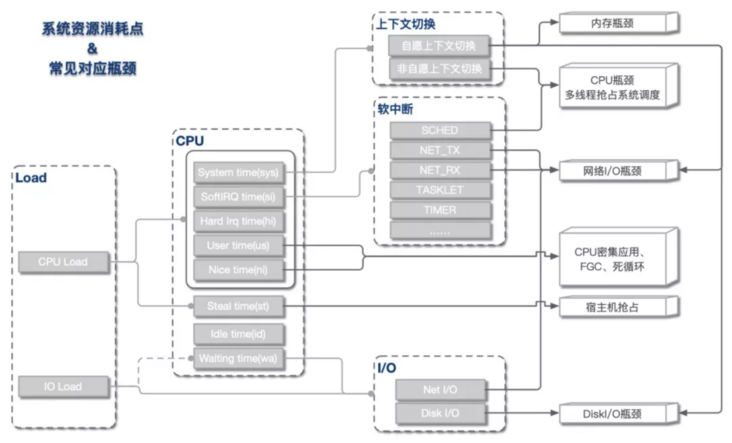

# CPU问题分析

### 1.资源与瓶颈分析

通过load average, CPU 和 IO情况可以进行定位定位与分析，总体来说有如下关系。

CPU的时间分片一般可分为4大类：用户进程运行时间 - User Time, 系统内核运行时间 - System Time, 空闲时间 - Idle Time, 被抢占时间 - Steal Time。除了Idle Time外，其余时间CPU都处于工作运行状态。在top命令中可以看到详细数据情况。

当发生异常时，我们需要根据各种命令以及数据情况判断问题原因。

### 2.Load高 & CPU高

这是我们最常遇到的一类情况，即load上涨是CPU负载上升导致。根据CPU具体资源分配表现，可分为以下几类：

#### CPU sys高：

这种情况CPU主要开销在于系统内核，可进一步查看上下文切换情况。

* 如果非自愿上下文切换较多，说明CPU抢占较为激烈，大量进程由于时间片已到等原因，被系统强制调度，进而发生的上下文切换。
* 如果自愿上下文切换较多，说明可能存在I/O、内存等系统资源瓶颈，大量进程无法获取所需资源，导致的上下文切换。

#### CPU si高

这种情况CPU大量消耗在软中断，可进一步查看软中断类型。一般而言，网络I/O或者线程调度引起软中断最为常见：

* NET_TX & NET_RX。NET_TX是发送网络数据包的软中断，NET_RX是接收网络数据包的软中断，这两种类型的软中断较高时，系统存在网络I/O瓶颈可能性较大。
* SCHED。SCHED为进程调度以及负载均衡引起的中断，这种中断出现较多时，系统存在较多进程切换，一般与非自愿上下文切换高同时出现，可能存在CPU瓶颈。

#### CPU us高
这种情况说明资源主要消耗在应用进程，可能引发的原因有以下几类：

* 死循环或代码中存在CPU密集计算。这种情况多核CPU us会同时上涨。
* 内存问题，导致大量FULLGC，阻塞线程。这种情况一般只有一核CPU us上涨。
* 资源等待造成线程池满，连带引发CPU上涨。这种情况下，线程池满等异常会同时出现

#### Load高& cpu低
这种情况出现的根本原因在于不可中断睡眠态(TASK_UNINTERRUPTIBLE)进程数较多，即CPU负载不高，但I/O负载较高。可进一步定位是磁盘I/O还是网络I/O导致。

### 3.排查策略

从问题发现到最终定位，大致分为四个阶段。

#### 1.资源瓶颈定位
这一阶段通过全局性能检测工具，初步定位资源消耗异常位点。

常用的工具有：

* top、vmstat、tsar(历史)
* 中断：/proc/softirqs、/proc/interrupts
* I/O：iostat、dstat

#### 2.热点进程定位
定位到资源瓶颈后，可进一步分析具体进程资源消耗情况，找到热点进程。

常用工具有：

* 上下文切换：pidstat -w
* CPU：pidstat -u
* I/O：iotop、pidstat -d
* 僵尸进程：ps

#### 3.线程&进程内部资源定位
找到具体进程后，可细化分析进程内部资源开销情况。

常用工具有：

* 上下文切换：pidstat -w -p [pid]
* CPU：pidstat -u -p [pid]
* I/O: lsof

#### 4.热点事件&方法分析
获取到热点线程后，我们可用trace或者dump工具，将线程反向关联，将问题范围定位到具体方法&堆栈。

常用的工具有：

* perf：Linux自带性能分析工具，功能类似hotmethod，基于事件采样原理，以性能事件为基础，支持针对处理器相关性能指标与操作系统相关性能指标的性能剖析。
* jstack
    * 结合ps -Lp或者pidstat -p一起使用，可初步定位热点线程。
    * 结合zprofile-threaddump一起使用，可统计线程分布、等锁情况，常用与线程数增加分析。
* strace：跟踪进程执行时的系统调用和所接收的信号。
* tcpdump：抓包分析，常用于网络I/O瓶颈定位。